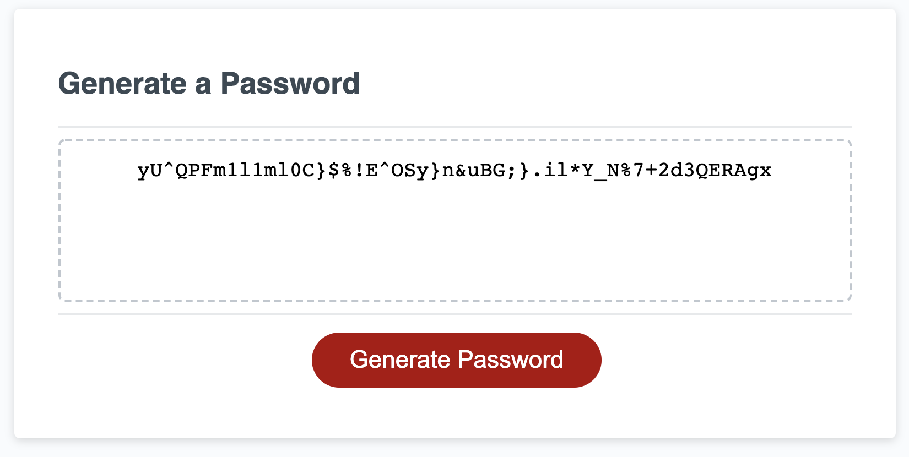

# Password Generator
A JavaScript program to randomly generate a password based on user inputs

## Site Link

<https://twyllblackleaf.github.io/password-generator/>

## Features

- User inputs for length of password and whether or not to use lowercase, uppercase, numeric, and special characters
- Input validation
    * Checks that length is a number within the acceptable range
    * Checks that at least one type of character is selected
    * Enables user to correct input errors before proceeding
- Output validation
    * Checks that at least one of every selected character type is used
    * Runs the password creation function until a password meeting the requirements is created

## About Me

Kat Dixon is a web developer who’s hungry for knowledge– and for opportunities to apply that knowledge as a programmer to enhance user experience; improve accessibility and security; and create stable, well-crafted, and elegantly functional code. I have a bachelor’s degree in English from Vanderbilt University and a certificate from Vanderbilt University Coding Boot Camp, a full-stack web development boot camp where I worked with JavaScript, HTML5, CSS, Node.js, Express, MySQL, Sequelize, MongoDB, and React. 

With my background in English, passion for psychology, and lived experience with disability and neurodivergence, along with my love of learning for learning’s sake, I bring value to any team through supporting others, enhancing communication between team members, and quickly picking up technologies needed for the project. 

In my spare time, I run games of Dungeons and Dragons, which provides a lot of experience with managing interpersonal interactions, considering and making deliberations on technical questions, and herding cats!
